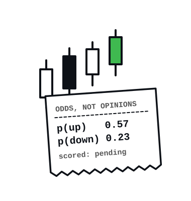
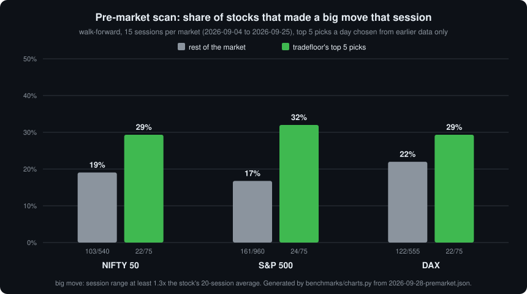
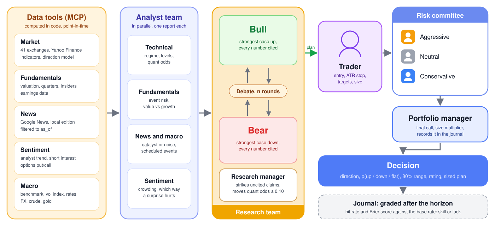
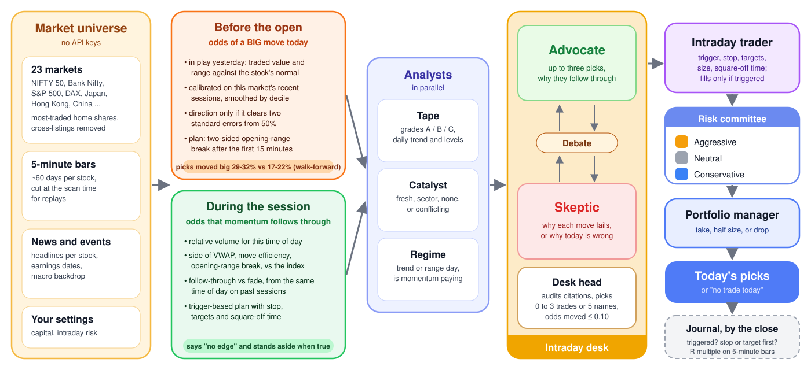
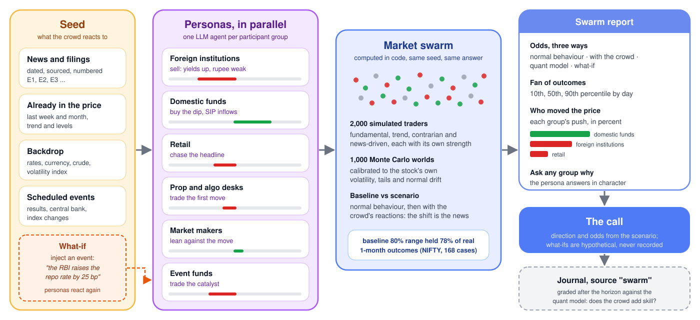

<p align="center">
  
</p>

<h1 align="center">tradefloor</h1>

<p align="center">
  <em>A multi-agent trading desk for coding agents. It quotes odds, not opinions, and keeps score.</em>
</p>

<p align="center">
  
  
  
  
  
</p>

<!-- numbers:start -->
<p align="center">
  <strong>Before the open it finds the day's big movers more often than chance. It does not know which way they will go, and it says so.</strong><br>
  <sub>Walk-forward over 15 sessions each of NIFTY 50, S&amp;P 500 and DAX stocks: its top 5 picks made big moves 29 to 32% of the time against 17 to 22% for the rest. Method, raw results and limits in the <a href="benchmarks/results/2026-09-28-premarket.md">pre-market writeup</a>. Not investment advice; it never places orders.</sub>
</p>
<!-- numbers:end -->

---

tradefloor is a plugin for Claude Code, Codex and Antigravity that runs a trading desk:
analysts research, a bull and a bear argue, a manager judges, a trader plans, a risk
committee pushes back, and a portfolio manager decides. The design is
[TradingAgents](https://github.com/TauricResearch/TradingAgents); three things differ:

- Every number comes from Python, not from the model. A probability is how often this
  instrument actually went up, down or sideways after setups like today's. The agents can
  move it by at most 0.10, with a written reason, and a manager agent strikes any figure it
  cannot trace to a tool.
- Every call is written to a journal and graded once its horizon passes, so you learn
  whether it has skill instead of being told.
- It works before the open and during the session, on 41 exchanges including India's NSE,
  with no API keys.
- It can simulate the crowd. `/tradefloor:swarm` has one persona agent per market
  participant group react to the news, then runs 2,000 simulated traders through 1,000
  worlds calibrated to the stock's own volatility, with what-if scenarios. The idea comes
  from [MiroFish](https://github.com/666ghj/MiroFish); the difference is that this one is
  checked against real outcomes and journaled.

It does not trade, does not predict prices, and cannot make a weak signal strong. It tells
you how strong the signal was, and later, whether it was right.

## Trust boundary

tradefloor is local code: an MCP server in Python and agent definitions in Markdown. It
needs no API keys and stores none. The server makes outbound requests only to Yahoo Finance
(through yfinance), Google News RSS, and Reddit when you enable it; it opens no ports.
Settings and the journal are plain JSON in `~/.tradefloor/`. On Claude Code the agent
definitions deny shell and file-edit tools; agents only write their own report files.
Headlines are untrusted text: every role that reads them is told they are data, not
instructions, but a crafted headline is still something a model reads. Read the run folder
before acting on it. The data is unofficial and delayed on many exchanges; every scan
reports by how much. Details: [SECURITY.md](SECURITY.md).

You know him. Twenty years on the floor. You bring him a tip from a group chat. He asks
what the stock did the last forty times the chart looked like this. You say this time is
different. He says forty-one percent, and writes your trade on a ticket with a stop on it.
Three weeks later he pulls the ticket out and tells you how it went.

He didn't say no. He said forty-one percent.

tradefloor puts him inside your AI agent.

## Before / after

Monday 2026-09-28, during the NSE session. Same prompt, same machine, run side by side in
headless Claude Code: *"Where is the NIFTY 50 heading over the next month? Give me a
direction and a trade plan."* The plain run had web search. Both replies verbatim, trimmed:

Without tradefloor (78 seconds):

> **My call: bearish-to-sideways for the next 2–3 weeks, with a good chance of a bounce off
> the 22,400–22,600 zone before month-end.** [...] I'd put roughly 55% on the market going
> lower or flat, and I have low confidence in that.
>
> - **Bearish (~40%):** [...]
> - **Range, then bounce (~40%):** [...]
> - **Sharp rally (~20%):** [...]
>
> Several figures (moving averages, flows, crude, the rupee) come from third-party market
> blogs I couldn't cross-check against NSE data.

With tradefloor (32 seconds):

> **NIFTY 50: a slight lean up over the next month, but the model's confidence is low.**
>
> | | Up | Down | Flat |
> |---|---|---|---|
> | Model probability | **57.5%** | 23.3% | 19.3% |
> | Usual rate for NIFTY | 53.0% | 27.1% | 20.0% |
>
> The model found 524 similar past setups, which count as only about 25 independent ones.
> After them, NIFTY rose 61% of the time [...] The edge over the usual rate is only about
> 4.5 points.
>
> I've logged this call in the journal (ID `5ebfe16f9f24`), so it can be scored against
> what actually happens after 21 trading days.

The first reply is careful and well sourced, and its odds came from nowhere: 55, 40, 40,
20, with no count behind them and nothing that will check them. The second counted, said
how little the count was worth, and wrote the call down. They lean opposite ways; after 21
trading days `/tradefloor:review` will say which one the market agreed with. Full replies:
[examples/before-after-2026-09-28/](examples/before-after-2026-09-28/).

## Numbers

The honest test for a pre-market scan is to run it on days it has not seen. For each of the
last 15 completed sessions, the model saw only earlier sessions, picked its top 5 stocks,
and was graded on what those stocks did that day against every other liquid stock in the
market.

<p align="center">
  
</p>

| 15 sessions per market, top 5 a day | NIFTY 50 | S&P 500 | DAX |
|---|--:|--:|--:|
| big move (range ≥ 1.3× normal): **picks** | **22 / 75 (29%)** | **24 / 75 (32%)** | **22 / 75 (29%)** |
| big move: rest of the market | 103 / 540 (19%) | 161 / 960 (17%) | 122 / 555 (22%) |
| clean trend day: picks / rest | 33% / 32% | 31% / 28% | 31% / 27% |
| opening-range trade, avg R: picks | +0.19 (38 trades) | 0.00 (17) | +0.15 (48) |
| opening-range trade, avg R: rest | +0.06 (346) | −0.11 (431) | 0.00 (414) |

It finds bigger movers in every market. It does not find cleaner trends, and the
opening-range column leans the right way on too few trades to call an edge.

What it looked for and did not find, reported the same way:

| Question | Answer | Sample |
|---|---|---|
| Does a strong day continue the next day? | 44% (NIFTY 50), 49% (S&P 500), 49% (DAX): a coin flip | ~40 sessions per market |
| Do the strongest live intraday moves follow through by the close? | NIFTY 50: 37% follow, 42% fade; S&P 500: 35% against 40% | ~53 sessions |
| Does an opening gap with an overnight company filing continue? | 51% of the time; 58% for big gaps | 283 gaps with news, 62 big; NSE |

So the pre-market scan shows a direction only when the data clears two standard errors
from 50%, which it usually does not, and the live desk mostly stands aside.

The market swarm is checked the same way: with no news reactions, its 80% range for the
next month should hold about 80% of real outcomes. On 12 past monthly dates
([writeup](benchmarks/results/2026-09-28-swarm-calibration.md)):

| 80% range held the real 1-month outcome | NIFTY 50 (168 cases) | S&P 500 (156 cases) |
|---|--:|--:|
| swarm baseline | 78% | 73% |
| quant model | 80% | 77% |
| outcome fell below the swarm's 10th percentile (should be 10%) | 16% | 13% |

Close on NIFTY stocks, still somewhat overconfident on the S&P 500's high-volatility names,
and short on downside tails. The first version held only 69% and 65%; the two fixes that
closed most of the gap are in the writeup. Whether the personas' reactions add skill on top
of the baseline is what the journal measures, call by call, as source `swarm`.

**Read these numbers with the limits attached.** One period (September 2026), 15 sessions
and 75 picks per market, Yahoo's unofficial 5-minute data, today's most-traded list applied
to past sessions, no costs or slippage in the trade column, and model settings chosen on the
same ~60-day window, so not a clean out-of-sample test. The chart is generated from the
[results file](benchmarks/results/2026-09-28-premarket.json) by
[`benchmarks/charts.py`](benchmarks/charts.py); nothing in it was drawn by hand. Rerun:
`uv run python server/scripts/eval_premarket.py "nifty 50" "s&p 500" dax`.

## How the desk works

For one instrument, `/tradefloor:analyze`:

<p align="center">
  
</p>

For a whole market, before the open or during the session, `/tradefloor:scout`:

<p align="center">
  
</p>

What a morning looks like: `/tradefloor:scout nifty 50`, run on Sunday 2026-09-27 for
Monday's session, eleven agents, from the [run folder](examples/scout-nifty-50-premarket-2026-09-28/):

```
Day: selective. Regime: range. Continuation after a strong day is 44% (within noise of a
coin flip), and all 8 candidates have lean: null, so the opening-range break picks the side.

KOTAKBANK.NS  either side, 0.5x   p_big_move 0.264 (base 0.234)   typical OR 2.425 (0.6%)
  Board approved the KMIL/KAAML merger on 09-25; moved only -0.71% on 1.47x traded value.
  Skip if it gaps past 407.95 / 399.45 and reverses back in. Square off by 15:05 IST.

Dropped: AXISBANK (no catalyst, fights the daily downtrend), MEESHO (all three risk seats
rejected), PAYTM (its usual opening range is wider than its own skip cap).
```

For how the crowd will take the news, `/tradefloor:swarm`:

<p align="center">
  
</p>

Each persona states its group's reaction as numbers (sentiment, conviction, how long it
lasts, where it thinks fair value is); the simulation turns them into odds and shows which
group moved the price. Add `what-if "the RBI raises the repo rate by 25 bp"` and the
personas react again to the injected event. Afterwards you can ask any group why, and its
persona answers in character from its own file. A real run, with the RBI what-if:
[examples/swarm-nifty-50-rbi-whatif-2026-09-28/](examples/swarm-nifty-50-rbi-whatif-2026-09-28/).

Each role writes a report file into `tradefloor-runs/...` and the next role reads the file,
not the chat, so every step can be inspected. Real run folders, unedited:
[examples/](examples/). The maths: [docs/architecture.md](docs/architecture.md). What
changed from the TradingAgents paper and why: [docs/research-notes.md](docs/research-notes.md).

## Install

Every route needs [uv](https://docs.astral.sh/uv/) on your PATH. The first start installs
the Python dependencies, about a minute once.

### Claude Code

```
/plugin marketplace add HimanshuJ16/tradefloor
```
```
/plugin install tradefloor@tradefloor
```

It asks for your home market, capital and risk. Change them later in `/config`.

### Codex

```bash
codex plugin marketplace add HimanshuJ16/tradefloor
codex plugin add tradefloor@tradefloor
```

Skills are invoked with `@`: `@scout nifty 50`, `@analyze RELIANCE.NS 1m`. Codex has no
plugin subagents, so one model plays the desk roles in turn.

### Antigravity

```bash
git clone https://github.com/HimanshuJ16/tradefloor
python tradefloor/tools/install.py antigravity --project /path/to/your/project
```

`--global` for every project, `--dry-run` to preview, `--remove` to undo. Existing config is
merged and backed up. In testing, Antigravity answered with the right numbers but skipped
the journal step; see [agent portability](docs/agent-portability.md).

### Any terminal

```bash
uv run --project tradefloor/server tradefloor intraday_scan "market=nifty 50"
```

Every tool is also a CLI command with the same JSON output; `tradefloor list` shows them.

That was it. He would tell you if it weren't.

### Configuration

None required. Claude Code asks when you enable the plugin. Elsewhere, tell the agent
"set my home market to NSE, capital to 500000, intraday risk to 0.5"; it saves
`~/.tradefloor/config.json`, which every host shares. Environment variables
(`TRADEFLOOR_DEFAULT_MARKET`, `TRADEFLOOR_CAPITAL`, and so on) override the file.

### What it costs

`/tradefloor:direction`, `/tradefloor:scan` and `scout ... quick` use no agents: one tool
call, seconds. A full desk is 11 to 12 subagent calls and took 9 to 12 minutes in testing;
analysts and debaters run on Sonnet, judges on your session model. Token cost has not been
measured.

### Uninstall

| Host | Command |
|------|---------|
| Claude Code | `/plugin remove tradefloor` |
| Codex | `codex plugin remove tradefloor` |
| Antigravity | `python tools/install.py antigravity --project <dir> --remove` |

That removes the plugin. Your settings and journal stay in `~/.tradefloor/`; delete the
folder to remove them.

## Commands

| Command | What it does |
|---------|--------------|
| `/tradefloor:scout <market>` | Before the open: stocks likely to make a big move today, with two-sided opening-range plans. During the session: live momentum picks. Full desk. |
| `/tradefloor:scout <market> quick` | The scan alone, no agents. |
| `/tradefloor:analyze <symbol> [horizon]` | The full desk on one stock, index, future, FX pair or coin: direction, odds, range, sized plan. |
| `/tradefloor:swarm <symbol> [horizon] [what-if "<event>"]` | Simulate the crowd reacting to the news: odds against normal behaviour, who moves the price, what-ifs. Ask any group why afterwards. |
| `/tradefloor:direction <symbol> [horizon]` | The quant model alone. |
| `/tradefloor:scan <symbols...>` | Rank a watchlist by how unusual today's setup is for each. |
| `/tradefloor:review [symbol]` | Grade past calls against what the market did. |

Markets for `scout`: `nifty 50`, `bank nifty`, `s&p 500`, `nasdaq 100`, `dax`,
`ftse 100`, `japan`, `hong kong`, `china`, `korea`, `taiwan`, `asx 200`, `tsx`, `brazil`
and more, or a comma-separated list. Symbols use Yahoo's suffixes (`RELIANCE.NS`, `7203.T`,
`SAP.DE`) or plain index names. Codex uses `@scout`, `@analyze`; plain questions work on
every host. Every command and option: [docs/commands.md](docs/commands.md).

## Scout modes

| Mode | When | What it predicts | Plan |
|------|------|------------------|------|
| `premarket` | before the open, when closed, or in the first 15 minutes | the chance of a big move today; a side only past two standard errors | two-sided opening-range break |
| `live` | 15 minutes into the session | the chance momentum follows through by the close | trigger, stop, targets, square-off |

Chosen by the clock; `premarket` or `live` forces one. `at "YYYY-MM-DD HH:MM"` replays any
moment in the last ~55 days, point-in-time.

## Development

```bash
python tools/build.py --check                                     # generated files match their sources
uv run --project server --group dev pytest -q tests server/tests  # offline tests
uv run --project server python server/scripts/smoke.py            # live: every tool over MCP
```

`rules/tradefloor.md` and `roles/*.md` are the only hand-edited copies of the protocol and
the twenty-three desk roles. `tools/build.py` generates the 80 host files from them (agents in
each host's format, rules files, manifests) and `--check` fails CI on drift. The tests
cover the no-look-ahead guarantee directly: features computed on truncated history must
equal the same rows computed on full history.

Recorded run of the suite (Python 3.14.0 in uv, Windows 11, 2026-09-28):

```
ran: python tools/build.py --check && uv run --project server --group dev pytest -q tests server/tests
result: 80 generated files match their sources; 104 passed
```

Contributing: [CONTRIBUTING.md](CONTRIBUTING.md). What comes next: [ROADMAP.md](ROADMAP.md).

## FAQ

**Does it make money?**
Unknown, and it is built to find out rather than to assert it. The pre-market scan
measurably picks bigger movers. No trading edge is established. Run `/tradefloor:review`
after a few weeks of calls.

**Why use an LLM at all if the numbers come from code?**
For what code does badly: reading filings and headlines, weighing a catalyst against a
chart, arguing both sides, and explaining the decision. The model is bounded: it can move a
probability by 0.10, not invent one.

**Look-ahead bias?**
Every dated tool takes `as_of` or `at` and returns nothing after it. Calibration only
labels outcomes known by then. Web search is off in replays. The tests check it.

**Is the data licensed?**
No. Yahoo Finance through yfinance is unofficial and meant for personal research; mind
Yahoo's terms. Keyed broker and vendor adapters are on the [roadmap](ROADMAP.md).

**Can it place trades?**
No, by design. Plans are conditional (they fill only if the trigger trades), and a human
places them.

**Why "tradefloor"?**
trading floor, *n.* The room where analysts, traders and risk managers argue before money
moves. This one keeps the tickets.

## Citation

The desk's design comes from Xiao, Sun, Luo and Wang,
[TradingAgents](https://arxiv.org/abs/2412.20138) (2024). No code is shared.

```
@article{xiao2024tradingagents,
  title   = {TradingAgents: Multi-Agents LLM Financial Trading Framework},
  author  = {Xiao, Yijia and Sun, Edward and Luo, Di and Wang, Wei},
  journal = {arXiv preprint arXiv:2412.20138},
  year    = {2024}
}
```

## License

[MIT](LICENSE).

## Star history

<a href="https://www.star-history.com/HimanshuJ16/tradefloor#history">
 <picture>
   <source media="(prefers-color-scheme: dark)" srcset="https://api.star-history.com/chart?repos=HimanshuJ16/tradefloor&type=Date&theme=dark" />
   <source media="(prefers-color-scheme: light)" srcset="https://api.star-history.com/chart?repos=HimanshuJ16/tradefloor&type=Date" />
   
 </picture>
</a>
