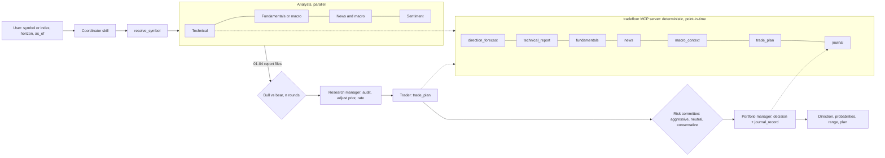

# Architecture



## Layers

**MCP server (`server/src/tradefloor/`)**. All data and all arithmetic.

| Module | Job |
|---|---|
| `markets.py` | Venue registry (suffix, currency, timezone, benchmark, vol index, FX pair, news locale), index aliases with tradeable proxies, symbol resolution, horizon parsing |
| `data.py` | yfinance prices (adjusted, truncated at `as_of`), fundamentals, Google News RSS, options and analyst data, 15-minute in-memory cache, stdout guarded |
| `indicators.py` | SMA, EMA, RSI, MACD, Bollinger, ATR, ADX, stochastic, OBV, realized and EWMA vol, swing levels, relative strength, beta |
| `forecast.py` | The direction model (below) |
| `plan.py` | Entry zone, ATR stop scaled to horizon, R-multiple targets, risk-based sizing with lot rounding and a position cap |
| `journal.py` | Append-only JSONL of calls in `~/.tradefloor/`, shared by every host; scoring once the horizon elapses |
| `settings.py` | User settings: env vars, then `~/.tradefloor/config.json`, then defaults; unexpanded `${...}` placeholders ignored |
| `intraday.py` | Intraday universes, session features (VWAP, relative volume by time of day, efficiency, opening range), momentum score, calibration on past sessions, trigger-based plans |
| `premarket.py` | Pre-market model: features known before the session, big-move and trend-day calibration with isotonic smoothing, a two-standard-error direction lean, two-sided opening-range plans and their simulation |
| `scout.py` | The intraday scan: screen the universe, fetch 5-minute bars, cut at `at`, choose pre-market or live mode, calibrate, rank |
| `swarm.py` | The market swarm: participant rosters, an agent-based simulation of thousands of traders over Monte Carlo worlds, calibrated to the stock's horizon spread, tails and drift; baseline, scenario, shift and attribution |
| `server.py` | 17 MCP tools, `quick_direction` first; every failure returned as `{"error": ...}` |
| `cli.py` | The same tools as `tradefloor <tool> key=value`, for agents with a shell but no MCP |

**Roles (`roles/`)**. Twenty-three desk roles, host-neutral, each tagged with its desk
(`analyze`, `scout`, `swarm`, or both for the three risk seats). `tools/build.py` renders them as
Claude Code subagents (`hosts/claude/agents/`: analysts and debaters on `sonnet`, judges on
the session model, mirroring the paper's quick/deep split, no Bash or Edit), portable
subagents for Antigravity (`agents/`), and single-context references for Codex
(`skills/<skill>/references/`). Only analysts can browse, and only in live runs.

**Skills (`skills/`)**. `analyze` (the single-instrument desk), `scout` (the intraday
desk), `direction` (one `quick_direction` call), `scan` (rank a watchlist), `review`
(score the journal). Host-neutral: defaults come from the server, and the desk skills name
each host's subagents with a fallback to playing the roles in turn.

**Hosts.** Manifests and instruction files for each agent host are generated from the
sources above; see [agent-portability.md](agent-portability.md).

**Shared state.** The run folder `tradefloor-runs/<symbol>/<date>-<horizon>/`. Each role
writes one file and later roles read files, not chat. This is the paper's "structured
documents in a global state", made inspectable: the user can open every intermediate
report.

## The direction model

For horizon h trading days:

1. **Setup score** in [-1, 1] for every past day: weighted sum of trend (distance from
   200-day plus 50-day slope), 3-month momentum, 12-1 month momentum, MACD histogram over
   ATR, RSI reversal (short horizons only) and 3-month relative strength against the
   exchange benchmark. Each factor is divided by its expanding standard deviation known at
   that day and passed through tanh. Weights shift from reversal and MACD at short
   horizons toward 12-1 momentum at long ones.
2. **Labels.** Each past day whose forward window closes on or before `as_of` gets its
   h-day forward log return, labelled up, down or flat. Flat means inside 0.25 of that
   day's h-day volatility.
3. **Similar setups.** Today's score falls in one quintile of the historical score
   distribution. The label frequencies inside that quintile are the conditional rates.
4. **Shrinkage.** Forward windows overlap, so n_eff = n / h. The conditional rates are
   blended with the unconditional base rates with weight n_eff / (n_eff + 20).
5. **Outputs.** Direction (UP or DOWN if one probability beats the other by 0.08,
   otherwise SIDEWAYS); tilt, the change in (p_up - p_down) against the base rate;
   confidence from the edge and n_eff; an 80% range from EWMA volatility times the square
   root of h, centred on the shrunk median drift of similar setups.

`tests/test_indicators_forecast.py` checks that factors computed on truncated history
equal the same rows computed on full history (no look-ahead), and that a driftless random
walk shows no large edge.

## The intraday desk (`scout`)

```
intraday_scan -> tape, catalyst, regime analysts (parallel) -> momentum advocate vs skeptic
             -> desk head (0 to 3 trades) -> intraday trader -> risk committee (parallel)
             -> intraday portfolio manager -> journal (graded on 5-minute bars by the close)
```

Universe: the market's most-traded ordinary shares from Yahoo's screener. Market cap
sorting alone returns foreign cross-listings first on venues such as Xetra, Milan, SIX and
B3, and Yahoo's quote fields have no reliable home-country flag, so candidates are ranked
by local traded value, with BDRs, Milan's foreign segment and preferred lines dropped.

Scoring at k bars into a session: direction is the side of VWAP when it agrees with the
move since the open; strength weights relative volume at this time of day (0.30), move
efficiency (0.25), move size against average daily range (0.15), an opening-range break
in the direction (0.15) and strength against the index (0.15). Calibration scores every
stock on each earlier session at the same k and labels the rest-of-session outcome
(follow-through, fade, or flat inside 0.1 ADR); the candidate's quintile gives its rates,
shrunk toward the pooled base rate with n_eff capped at three per session because stocks
move together.

Pre-market (before the open, closed, or under 15 minutes in): features known before the
target session, each stock against its own last 20 sessions: yesterday's traded value and
range as multiples of normal, yesterday's move and close location. The in-play score is
the mean pooled percentile of the two multiples. Outcomes: big move (session range at
least 1.3x the 20-session average) and trend day. Rates per decile of the in-play score
are smoothed to be non-decreasing (pool-adjacent-violators) and shrunk to the base rate.
A direction lean is shown only when strong-day continuation in the pool departs from 50%
by two standard errors. Earnings on the target session put a stock at the top with a gap
warning. Plans are two-sided 15-minute opening-range breaks; `simulate_orb` grades them.

Journal grading for intraday calls: triggered or not; after the trigger, the first of the
stop or the first target, with a bar touching both counted as the stop; otherwise the
close. Results in R multiples. Pre-market picks are graded on their target session: did
the big move come (with a Brier score for p_big_move), and how did the two-sided
opening-range trade do.

## Cost per analysis

| Depth | Agent calls | Notes |
|---|---|---|
| quick (`/tradefloor:direction`) | 0 | one `quick_direction` call |
| standard | 12 | 4 analysts, 2 debaters x 1 round, manager, trader, 3 risk seats, PM |
| deep | 17 | 2 debate rounds, 2 risk rounds |
| scout quick | 0 | one `intraday_scan` call: 10 to 15 seconds live, 20 to 30 seconds pre-market |
| scout standard | 11 | 3 analysts, 2 debaters, desk head, trader, 3 risk seats, PM |

Analysts run in parallel, as do the debaters in each round and the risk seats.

## Point in time

Every dated tool takes `as_of` and returns nothing after it: price history is cut at
`as_of`, news is filtered by publish time, and the forecast only labels days whose forward
window closed by `as_of`. Sources that are only available as current snapshots
(fundamentals, analyst targets, short interest, options, Reddit) carry
`point_in_time: false`, and agents are told to drop them in historical runs. Web search
is disabled for historical runs.

## What is deliberately absent

- **Order execution.** No broker integration. The plan is a suggestion a human places.
- **Index constituent lists.** They change; a stale list produces survivorship bias.
- **Fitted models.** Fitting weights per symbol on a few hundred effective observations
  overfits. The empirical conditional frequencies are the calibration.
